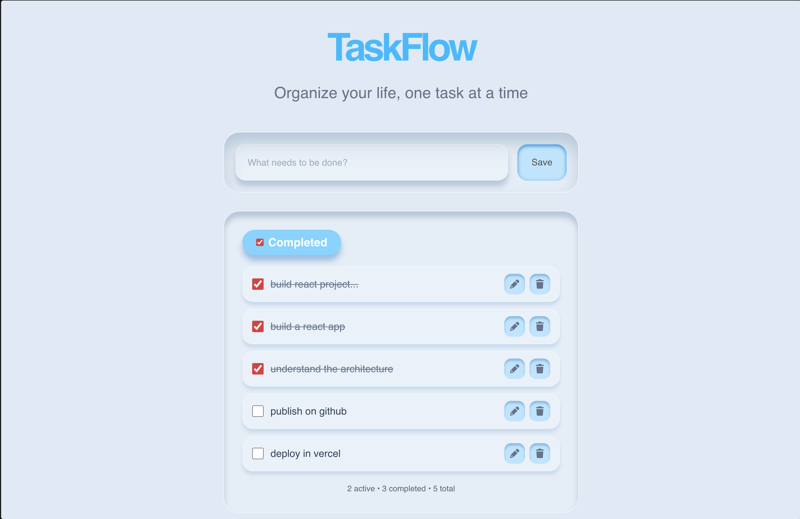

# TaskFlow

A simple and minimal Todo application built with React.

## Features

- Add new tasks
- Edit tasks
- Delete tasks
- Mark tasks as completed
- Filter completed tasks
- Tasks persist using Local Storage
- Responsive and minimal UI

## Tech Stack

- React
- Tailwind CSS
- JavaScript
- Local Storage
- Font Awesome
- UUID

## Screenshot



## Live Demo

[TaskFlow](https://mohitchauhan-stack.github.io/Task_Manager_app/)

## Run Locally

```bash
git clone https://github.com/mohitchauhan-stack/Task_Manager_app.git
cd Task_Manager_app
npm install
npm run dev
```
